# Kubernetes Deployment & Monitoring of Java-based Sock-Shop Microservices App from WeaveWorks on AWS EKS

The sock-shop app is a microservice architecture that comprises of 14 application services distributed across a Kubernetes Cluster of 3 worker nodes and 1 'managed' control plane (managed by AWS' Elastic Kubernetes Service or EKS). It's a moderately engaging microservice architecture that teaches and demonstrates the mechanism and workflow involved in a microservice deployment and orchestration on Kubernetes.

Within this README, I endeavour to elaborate my process of building, architecting, and orchestrating the sock-shop microservice application using:
1. Infrastructure as code (IAC) tools like Terraform,
2. Version control tools like Git,
3. Containerization Technnologies like Docker and ContainerD,
4. Orchestration tools like Kubernetes (K8s),
5. A Kubernetes Package Manager tool known as Helm,
6. Cluster monitoring tools such as:
   1. Prometheus for cluster, node, and pod metrics,
   2. Grafana for data visualization of metrics (primarily datasourced by Prometheus),
   3. Alertmanager for alerting & notifications.
7. Bash scripting for automating and securing workflows,
8. Cluster Ingress Controller tools such as ingress-nginx,
9. Cluster HTTPS TLS Certificate Authority Management tools such as cert-manager,
10. Cloud-managed Kubernetes Services like AWS EKS.

## Project Filesystem

Below I provide my project filesystem organization for easy traversal and understanding of my project workflow, files, directories, and application.

```plaintext
.
|-- deploy
|   |-- ingress
|   |   |-- issuer.yaml
|   |   `-- sockshop
|   |       `-- ingress.yaml
|   |-- manifests
|   |   |-- 00-sock-shop-ns.yaml
|   |   |-- 01-carts-dep.yaml
|   |   |-- 02-carts-svc.yml
|   |   |-- 03-carts-db-dep.yaml
|   |   |-- 04-carts-db-svc.yaml
|   |   |-- 05-catalogue-dep.yaml
|   |   |-- 06-catalogue-svc.yaml
|   |   |-- 07-catalogue-db-dep.yaml
|   |   |-- 08-catalogue-db-svc.yaml
|   |   |-- 09-front-end-dep.yaml
|   |   |-- 10-front-end-svc.yaml
|   |   |-- 11-orders-dep.yaml
|   |   |-- 12-orders-svc.yaml
|   |   |-- 13-orders-db-dep.yaml
|   |   |-- 14-orders-db-svc.yaml
|   |   |-- 15-payment-dep.yaml
|   |   |-- 16-payment-svc.yaml
|   |   |-- 17-queue-master-dep.yaml
|   |   |-- 18-queue-master-svc.yaml
|   |   |-- 19-rabbitmq-dep.yaml
|   |   |-- 20-rabbitmq-svc.yaml
|   |   |-- 21-session-db-dep.yaml
|   |   |-- 22-session-db-svc.yaml
|   |   |-- 23-shipping-dep.yaml
|   |   |-- 24-shipping-svc.yaml
|   |   |-- 25-user-dep.yaml
|   |   |-- 26-user-svc.yaml
|   |   |-- 27-user-db-dep.yaml
|   |   `-- 28-user-db-svc.yaml
|   `-- monitoring
|       |-- alertmanager
|       |   `-- test-slack-integration.sh
|       `-- values.yaml
`-- terraform
    |-- main.tf
    |-- outputs.tf
    |-- terraform.tf
    `-- variables.tf

7 directories, 37 files
```

## Sock-Shop Architecture

Below is the Kubernetes deployment architecture of the sock-shop microservices app.

> Sock-Shop AWS EKS Cloud Architecture

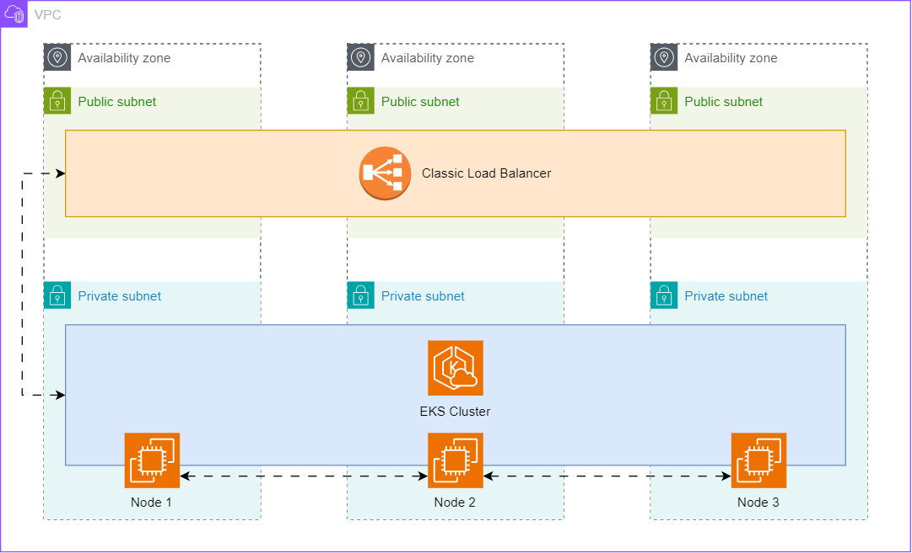

...[updating]


## Deployment Walkthrough

...[updating]

## Sock-Shop Deployment & Monitoring Images

> WeaveWorks Sock-Shop microservice app deployed on Kubernetes Cluster (AWS EKS).

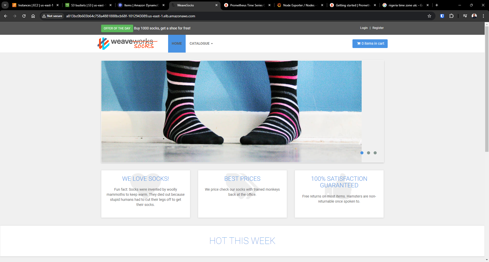

> Fully Qualified Domain Name (FQDN) "sockshop.allwell.cloud" affixed/configured together with ingress and tls termination at the ingress controller (powered by cert-manager).

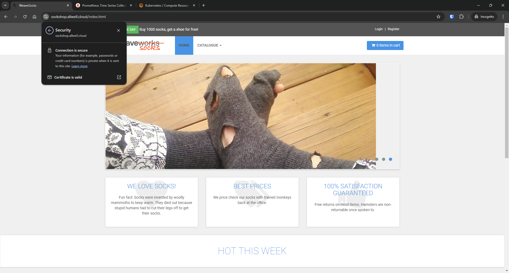

> Testing: trying to log into sock-shop microservice app to test `user` and `user-db` service.

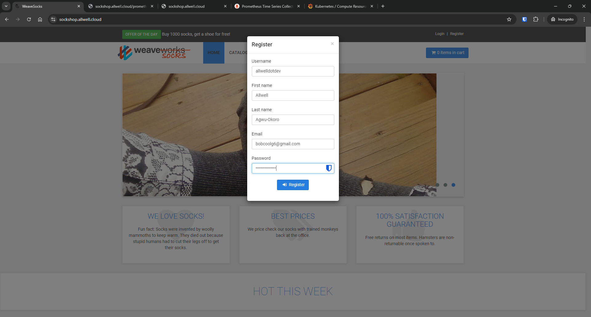

> Logged in! (see user credentials at top-right of browser window) Testing: `cart` and `cart-db` service is working. I changed the container image from `:latest` to an older, more stable image, different from what was specified in the WeaveWorks config files to get it to function properly.

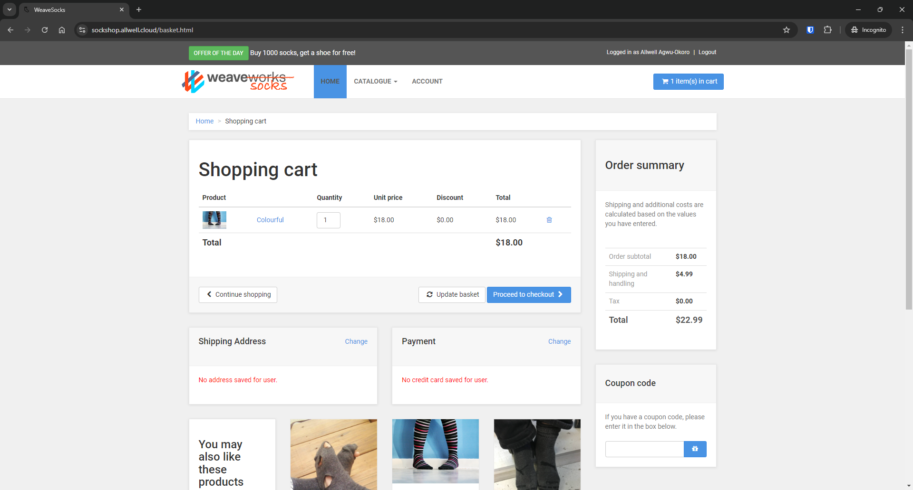

> Testing: confirmed Prometheus connection to the cluster, nodes, and pods, by checking status targets. They were all UP.

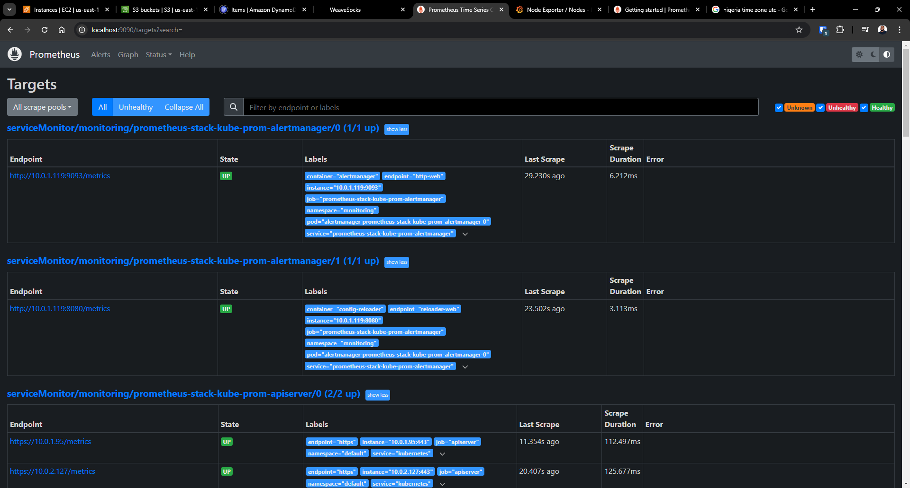

> Monitoring: node CPU load with a 15-min interval on Prometheus.

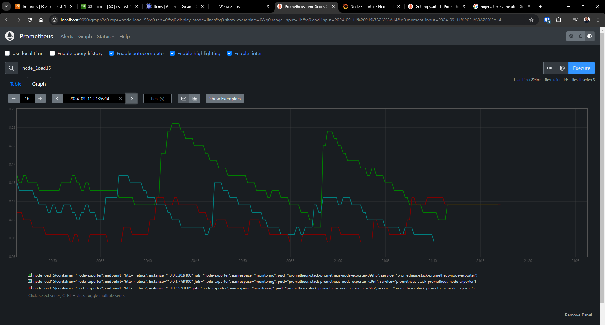

> Data Visualization: Grafana datasourcing node-exporter metrics from Prometheus of all 3 worker node and displaying it.

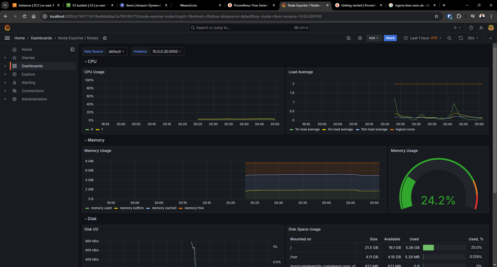

> Data Visualization: Grafana displaying Kubernetes Compute Resources by Cluster.

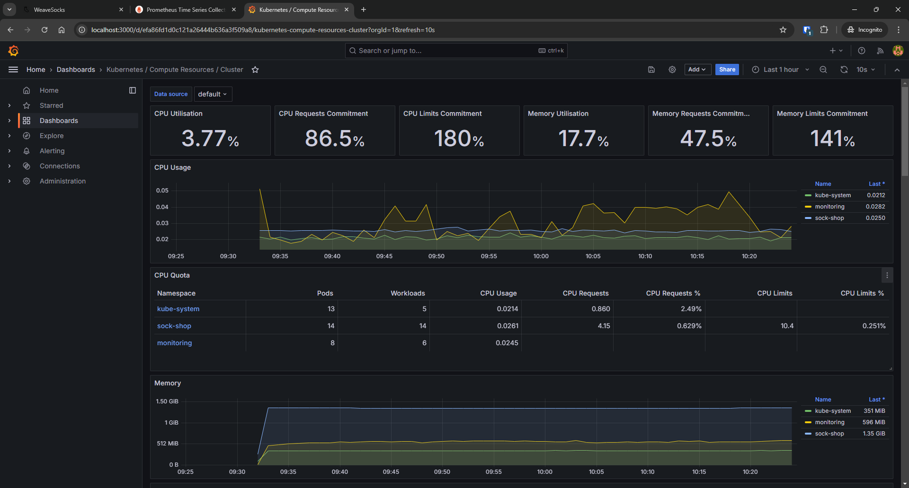

> Data Visualization: Grafana displaying Kubernetes Compute Resources by Namespace (Pods).

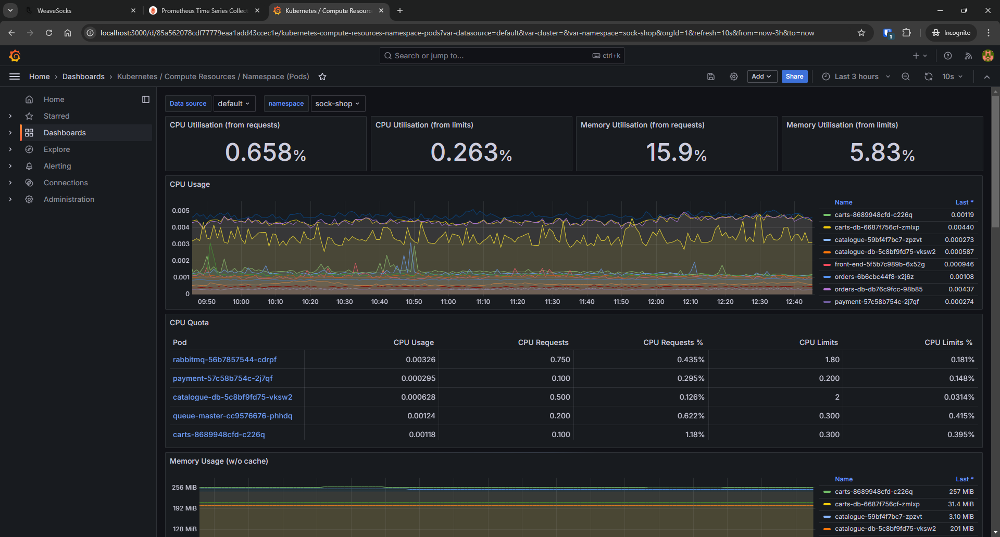

> Alerting: Alertmanager configured to send firing alerts to Slack channel called `#sockshop-alerts`.

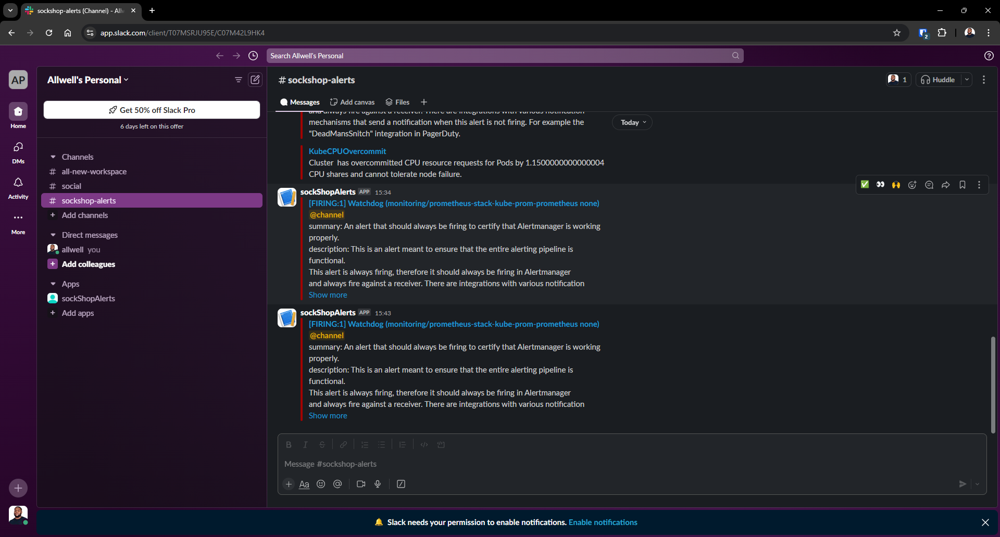


<!-- The WeaveWorks sock-shop microservices app deployment using WeaveWork's deployment scripts &amp; config. -->
