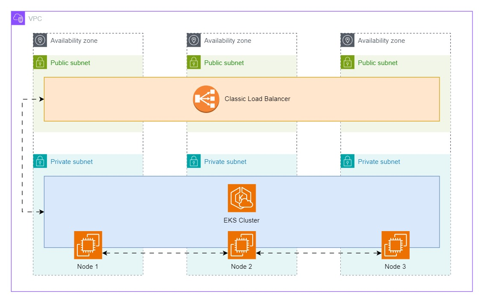
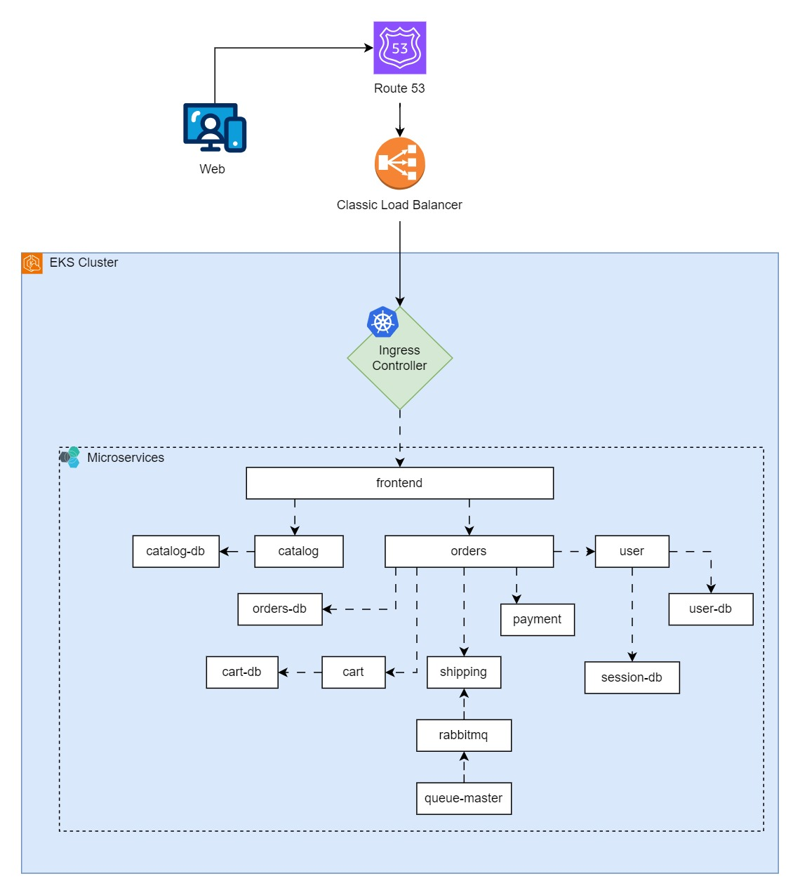

# Kubernetes Deployment & Monitoring of Java-based Sock-Shop Microservices App from WeaveWorks on AWS EKS

The sock-shop app is a microservice architecture that comprises of 14 application services distributed across a Kubernetes Cluster of 3 worker nodes and 1 'managed' control plane (managed by AWS' Elastic Kubernetes Service or EKS). It's a moderately engaging microservice architecture that teaches and demonstrates the mechanism and workflow involved in a microservice deployment and orchestration on Kubernetes.

Within this README, I endeavour to elaborate my process of building, architecting, and orchestrating the sock-shop microservice application using:
1. Infrastructure as code (IAC) tools like Terraform,
2. Version control tools like Git,
3. Containerization Technnologies like Docker and ContainerD,
4. Orchestration tools like Kubernetes (K8s),
5. A Kubernetes Package Manager tool known as Helm,
6. Cluster monitoring tools such as:
   1. Prometheus for cluster, node, and pod metrics,
   2. Grafana for data visualization of metrics (primarily datasourced by Prometheus),
   3. Alertmanager for alerting & notifications.
7. Bash scripting for automating and securing workflows,
8. Cluster Ingress Controller tools such as ingress-nginx,
9. Cluster HTTPS TLS Certificate Authority Management tools such as cert-manager,
10. Cloud-managed Kubernetes Services like AWS EKS.

## Project Filesystem

Below I provide my project filesystem organization for easy traversal and understanding of my project workflow, files, directories, and application.

```plaintext
.
|-- deploy
|   |-- ingress
|   |   |-- issuer.yaml
|   |   `-- sockshop
|   |       `-- ingress.yaml
|   |-- manifests
|   |   |-- 00-sock-shop-ns.yaml
|   |   |-- 01-carts-dep.yaml
|   |   |-- 02-carts-svc.yml
|   |   |-- 03-carts-db-dep.yaml
|   |   |-- 04-carts-db-svc.yaml
|   |   |-- 05-catalogue-dep.yaml
|   |   |-- 06-catalogue-svc.yaml
|   |   |-- 07-catalogue-db-dep.yaml
|   |   |-- 08-catalogue-db-svc.yaml
|   |   |-- 09-front-end-dep.yaml
|   |   |-- 10-front-end-svc.yaml
|   |   |-- 11-orders-dep.yaml
|   |   |-- 12-orders-svc.yaml
|   |   |-- 13-orders-db-dep.yaml
|   |   |-- 14-orders-db-svc.yaml
|   |   |-- 15-payment-dep.yaml
|   |   |-- 16-payment-svc.yaml
|   |   |-- 17-queue-master-dep.yaml
|   |   |-- 18-queue-master-svc.yaml
|   |   |-- 19-rabbitmq-dep.yaml
|   |   |-- 20-rabbitmq-svc.yaml
|   |   |-- 21-session-db-dep.yaml
|   |   |-- 22-session-db-svc.yaml
|   |   |-- 23-shipping-dep.yaml
|   |   |-- 24-shipping-svc.yaml
|   |   |-- 25-user-dep.yaml
|   |   |-- 26-user-svc.yaml
|   |   |-- 27-user-db-dep.yaml
|   |   `-- 28-user-db-svc.yaml
|   `-- monitoring
|       |-- alertmanager
|       |   `-- test-slack-integration.sh
|       `-- values.yaml
`-- terraform
    |-- main.tf
    |-- outputs.tf
    |-- terraform.tf
    `-- variables.tf

7 directories, 37 files
```

## Sock-Shop Architecture

Below is the Kubernetes deployment architecture of the sock-shop microservices app.

> Sock-Shop AWS EKS Cloud Architecture



> Sock-Shop Microservices App Architecture



## Deployment Walkthrough

### Sourcing Environment Variables

Before we commence the deployment walkthrough, there are some environment variables required for some technologies to functions properly which I provision within my dev and prod environment but are not available with this git repo. You'll have to generate them using your own outputs for your own use. These environment variables are:
- `SLACK_WEBHOOK_URL`
- `SLACK_CHANNEL`
- `GRAFANA_ADMIN_PASSWORD`
- `LETS_ENCRYPT_EMAIL`
- awscli configuration credentials and environment variables (needed by Terraform IAC).

This is done to improve the security of our deployment and version control storage of our config files. To include environment variables in the configuration, export them into the shell/terminal process like so:

```bash
export SLACK_WEBHOOK_URL='input_url_here'
```

Or via a file, like so:

```bash
source /path/to/file
```

### Building AWS EKS Infrastructure using Terraform

```console
terraform init
```

I used Terraform (IAC) to automate, plan, and manage the infrastructure building of AWS EKS. My Terraform configuration `./terraform/main.tf` creates:
- a VPC (Virtual Private Cloud) in AWS,
- 3 private and public subnets within the VPC,
- an EKS (AWS Kubernetes Service) in the private subnets spread across 3 availabliity zones for high-availability,
- and an AWS IAM role that allows the EKS service to assume an IAM role to create persistent volumes and block storage with the cluster.

```console
terraform plan
```

To run the Terraform configuration, I have added variables to allow further customization and infrastructure management. These variables, which can be found in `./terraform/variables.tf`, include:
- `aws_region` [The aws region to create resources in. Default: `us-east-1`],
- `vpc_cidr` [The VPC CIDR block. Default: `10.0.0.0/16`],
- `private_subnet_cidrs` [The private subnet CIDR block. Default: `["10.0.0.0/24", "10.0.1.0/24", "10.0.2.0/24"]`]
- `public_subnet_cidrs` [The public subnet CIDR block. Default: `[10.0.100.0/24", "10.0.101.0/24", "10.0.102.0/24]`]
- `instance_type` [The instance type to use for the Kubernetes nodes. Default: `t3.large`],
- `node_count` [The number of nodes in the cluster. Default: `3`].

```console
terraform apply
```

The Terraform configuration takes ~ 10 mins to run. After it's finished running, the following outputs below are parsed which allow me to configure my kubectl Kubernetes server using the AWS EKS kubeconfig I just spun up using Terraform IAC. Terraform outputs include:
- `cluster_endpoint` [Endpoint for EKS control plane]
- `region` [AWS region]
- `cluster_name` [Kubernetes Cluster Name]

```console
aws eks --region $(terraform output -raw region) update-kubeconfig --name $(terraform output -raw cluster_name)
```

### Deploy Microservices in Kubernetes Cluster

At this point, I've configured three things; environment variables, AWS EKS using terraform, and kubeconfig. Next, I deploy the sock-shop microservices app via the Kubernetes manifests in `./deploy/manifests/`.

```console
kubectl apply -f deploy/manifests
```

> At the first attempt of deploying the raw config files from the [deprecated Weaveworks repo](https://github.com/microservices-demo/microservices-demo), I came up on some errors which I later engineered solutions for (to be described in a later heading to be titled 'Encountered Problems & Solutions').

### Deploy Monitoring 

Once sock-shop microservices is deployed in Kubernetes cluster, I used Helm to install Kubernetes monitoring resources like Prometheus, Grafana, and AlertManager via the kube

```console
envsubst < source_file | helm install prometheus -n monitoring --values=-
```

...[updating]

## Sock-Shop Deployment & Monitoring Images

> WeaveWorks Sock-Shop microservice app deployed on Kubernetes Cluster (AWS EKS).


> Fully Qualified Domain Name (FQDN) "sockshop.allwell.cloud" affixed/configured together with ingress and tls termination at the ingress controller (powered by cert-manager).


> Testing: trying to log into sock-shop microservice app to test `user` and `user-db` service.


> Logged in! (see user credentials at top-right of browser window) Testing: `cart` and `cart-db` service is working. I changed the container image from `:latest` to an older, more stable image, different from what was specified in the WeaveWorks config files to get it to function properly.


> Testing: confirmed Prometheus connection to the cluster, nodes, and pods, by checking status targets. They were all UP.


> Monitoring: node CPU load with a 15-min interval on Prometheus.


> Data Visualization: Grafana datasourcing node-exporter metrics from Prometheus of all 3 worker node and displaying it.


> Data Visualization: Grafana displaying Kubernetes Compute Resources by Cluster.


> Data Visualization: Grafana displaying Kubernetes Compute Resources by Namespace (Pods).


> Alerting: Alertmanager configured to send firing alerts to Slack channel called `#sockshop-alerts`.


<!-- The WeaveWorks sock-shop microservices app deployment using WeaveWork's deployment scripts &amp; config. -->
